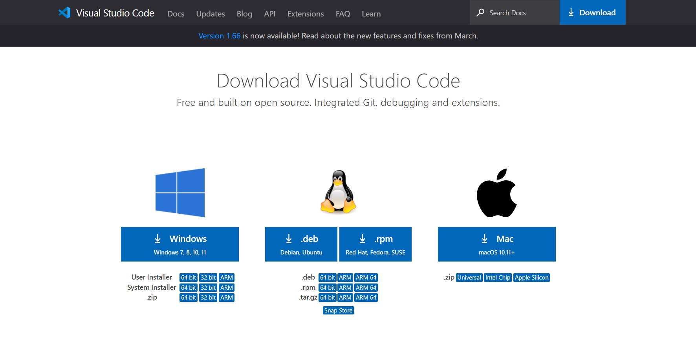

# Lab Report Week 2: Logging into your ieng6 account
## Installing VSCode
* Go to this link below and click download in the top right.
<br>
[VSCode_Download_Link](https://code.visualstudio.com/)

* The page above will come up and just choose your operating system, and complete the download instructions.


* Once it is downloaded you can open VSCode and you will see this page above. From here you will be able to connect to ieng6.

## Remote Connecting
* The first step to remotely connecting to ieng6 is to install OpenSSH. Click the link below and follow the instructions to install it.

[OpenSSH_Download_Link](https://docs.microsoft.com/en-us/windows-server/administration/openssh/openssh_install_firstuse)

* Next, look up your specific account name you will use to connect to ieng6 using the link below. Sign in once you open the link and you will find your account name.

[Account_LookUp](https://sdacs.ucsd.edu/~icc/index.php)
* Next, open the terminal using the terminal button at the top of VSCode. Then to log in use the command below in the terminal, but replace the zz with your the letters that your account has in that same spot.
```
ssh cs15lsp22zz@ieng6.ucsd.edu
```
* Now since it is the first time you will log into the remote connect it will ask you a couple questions, so respond yes to all of them. Then it will prompt you to put in your password and you should do so. Now you will see what is included in the screen shot below.


## Trying Some Commands
* Below is a list of commands that you can use in the remote server. They're uses range from navigating directories, to viewing files contained within the remote server, to creating and copying files in the remote server. 
```
$ cd ~
$ cd
$ ls -lat
$ ls -a
$ ls </home/linux/ieng6/cs15lsp22/cs15lsp22zz>, where zz is replaced with the letters from a username
$ cp /home/linux/ieng6/cs15lsp22/public/hello.txt ~/
$ cat /home/linux/ieng6/cs15lsp22/public/hello.txt
$ exit (Ctrl+D also works)
```
* Below is what happens when you put ls -lat into both the remote server (on right) and your local computer (on the left). For the remote computer ls -lat shows all the files in the server that the user has access to in chronological order. This command even shows the files that are usually hidden to the user if they were to just do a ls command. For my computer ls -lat does not work as ls already shows all the files that the directory has, therefore ls -lat is not needed.


## Moving Files with `scp`
* The command `scp` is used in your local computer to copy a file from your computer to the remote server. To copy a file you must first create a file in your computer within VSCode. In VSCode create a file called WhereAmI.java and put the following code into the file:

```
class WhereAmI {
  public static void main(String[] args) {
    System.out.println(System.getProperty("os.name"));
    System.out.println(System.getProperty("user.name"));
    System.out.println(System.getProperty("user.home"));
    System.out.println(System.getProperty("user.dir"));
  }
}
```
* Now that the file has been created you can copy it over to the remote server using the command below. (Make sure to replace the zz with the letters from your account)

```
scp WhereAmI.java cs15lsp22zz@ieng6.ucsd.edu:~/
```
* After inputing this command the remote server will ask you to input your password. Once you do so the file will be copied over to the remote server, where you can run it if you like. In the screenshot below is what it looks like when you successfully copy the WhereAmI.java file to the remote server.


## Setting a SSH Key
* So far in this tutorial, you have had to log into your ieng6 account many times and each time you had to put in your password, which wastes a lot of time. Luckily, there is something called ssh keys that can be used to make it so when you put in your username using the ssh or scp command you will automatically be logged in without having to put in your password. Use the code below on your local computer to create the key.

```
$ ssh-keygen
```
* You will be prompted to enter a passphrase, but you don't want to create one for this, so just click enter at both times it prompts you. Now you will have to copy the key to the remote server so it can be used to skip having to put in your password. Log into the remote server and put in the following commands:
```
$ mkdir .ssh
$ exit
# back on client
$ scp /Users/<user-name>/.ssh/id_rsa.pub cs15lsp22zz@ieng6.ucsd.edu:~/.ssh/authorized_keys
# You use your username and the path you saw when creating the key on your local computer
```
* Now you should be able to log in to the server and copy files to it without having to put in your password. Below is a screenshot of what it looks like when you don't have to input a password when logging in.


## Optimizing Remote Running
* There are commands that you can use to do more than one action at a time to be more efficient, and use less keystrokes. This will help you save time when working with the remote server. Listed below are some of those commands:
```
# In local computer
$ ssh cs15lsp22zz@ieng6.ucsd.edu "ls -lat"
```
* By putting a command in quotations after using the log in command you can run said command and then be automattically signed in and out of the remote server to do so. Below is what it looks like to run the above command:


```
# Within the remote server
& javac OtherMain.java; java OtherMain.java
```
* The command above uses semi-colons inbetween commands to do mulitple commands at once. In the example above I am compiling and running a file in the same line. Below is what it looks like to run this command:


* A couple other things you can do to be more efficient is to use the up arrow key to get you last commands you put into the terminal. You can also have your username copied that way whenever you use it you can just paste it instead of having to type it out everytime.

## Congratulations, you are done with this tutorial!


