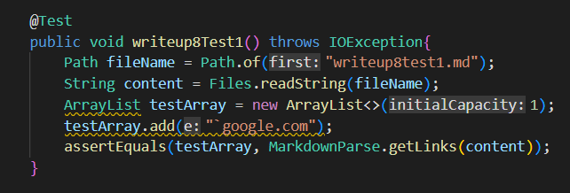
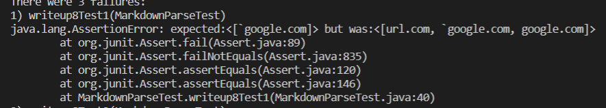
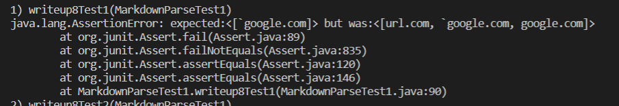

# Lab Report 4 - Week 8
Their Repo: [theirrepo](https://github.com/ANGUYEN625/markdown-parser)
## Snippet 1
The code should produce ['google]

My Implementation:

Their Implementation:

## Snippet 2
The code should produce [a.com, a.com(()), example.com]
!