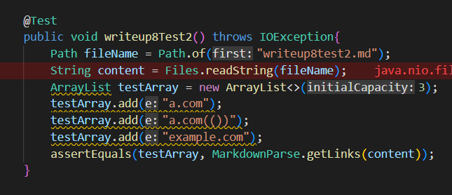
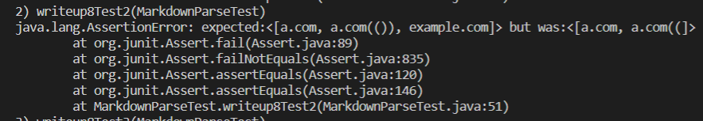
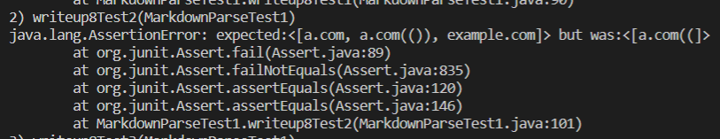
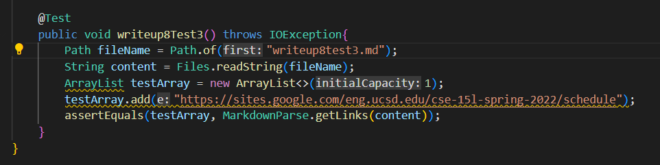
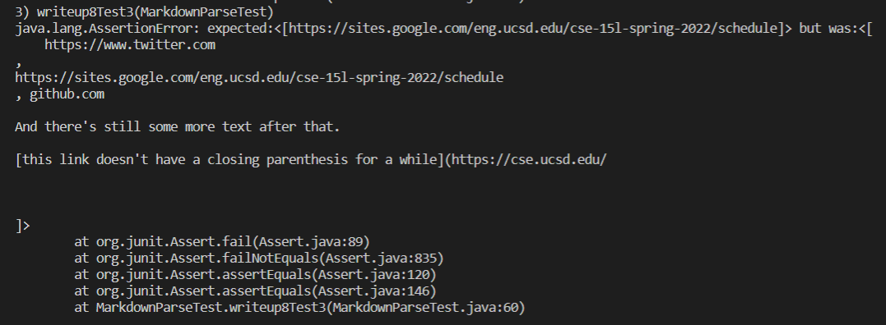
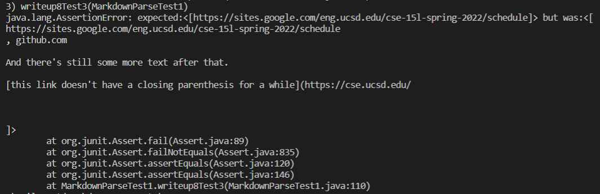

# Lab Report 4 - Week 8
Their Repo: [theirrepo](https://github.com/ANGUYEN625/markdown-parser)
## Snippet 1
The code should produce: ['google]
 
Test:

My Implementation: Did not pass

Their Implementation: Did not pass

## Snippet 2
The code should produce: [a.com, a.com(()), example.com]
 
Test:

My Implementation: Did not pass

Their Implementation: Did not pass

## Snippet 3
The code should produce: [https://sites.google.com/eng.ucsd.edu/cse-15l-spring-2022/schedule]
 
Test:

My Implementation: Did not pass

Their Implementation: Did not pass

## Questions:

* Do you think there is a small (<10 lines) code change that will make your program work for snippet 1 and all related cases that use inline code with backticks? If yes, describe the code change. If not, describe why it would be a more involved change.
    * I think that there is a small change you could make to make the program work. You would have to create a small if statement to check for the existence of backticks before the start parentheses. I say this as all the links that should not have worked that got in had just extra backticks within the brackets, and this should not allow a link to work.
* Do you think there is a small (<10 lines) code change that will make your program work for snippet 2 and all related cases that nest parentheses, brackets, and escaped brackets? If yes, describe the code change. If not, describe why it would be a more involved change.
    * I do not think there is a small code change that could be made to fix snippet 2 and all related cases with nested brackets, escaped brackets, and parentheses. I think that in order to fix my code from incorrectly cutting off links and not getting some links I would need to make a for or while loop with a counter for brackets, parentheses, and escaped brackets, that way I can determine if there is the right amount of each and what the actually link is. This code would be larger than 10 lines as it requires a loop that counts brackets, escaped brackets, and parentheses. Then with this information there has to be if statements to check the validity of the information gathered from the counters, and what to do depending on the counts. This is enough code to make a entire method. 
* Do you think there is a small (<10 lines) code change that will make your program work for snippet 3 and all related cases that have newlines in brackets and parentheses? If yes, describe the code change. If not, describe why it would be a more involved change
    * My code picked up a lot of extra links that had gaps between brackets and parentheses that were not suppose to be allowed. I think in order to fix this code you can can check for how many new lines there are by checking for "\n". Within snippet 3 only one new line is allowed between any code segments, so what this means is there are no empty gaps between the code. The rest of the links either have these gaps or are missing parentheses. Thus by creating an if statment to make sure that there are not too many new lines, as in more than 1 without new text, this code could be fixed. This is not a large change so it would not take more than 10 lines.

