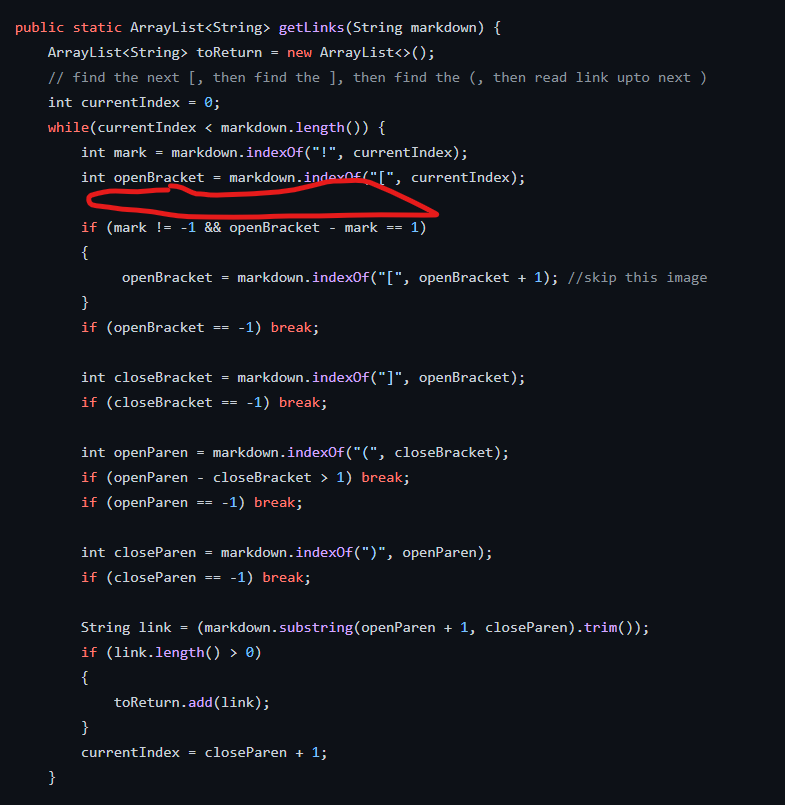

# Lab Report Week 5 Week 10
To find the tests with different results we used Vimdiff with the two result files. These result files were made from running the tests in each repository and having the results put into a file.
## Test 472
[Test 472](https://github.com/nidhidhamnani/markdown-parser/blob/main/test-files/472.md)

Actual Output: 
Because the actual result is bar* the link associated with this is /url, so what the code should get is /url. Our test code on the left is incorrect as the code is suppose to have /url in the list. The provided code is correct as it has the /url in the list. 
 
Bug: I think the bug with the code is that it does not know what to do when there is a astrek before the bracket so that is messing with the code in how it reads for the link. It searches for a bracket as the first thing and when it finds something than other than that it has an error.

The red circle is where to add an if statment to check for *.

## Test 473
[Test 473](https://github.com/nidhidhamnani/markdown-parser/blob/main/test-files/473.md)

Actual Output: 
Because the actual result is bar* the link associated with this is /url, so what the code should get is /url. Our test code on the left is incorrect as the code is suppose to have /url in the list. The provided code is correct as it has the /url in the list.
 
Bug: I think the bug with the code is that it does not know what to do when there is a _foo before the bracket so that is messing with the code in how it reads for the link. It searches for a bracket as the first thing and when it finds something than other than that it has an error.

The red circle is where to add an if statment to check for other characters.
