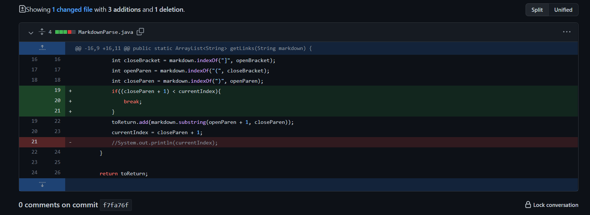
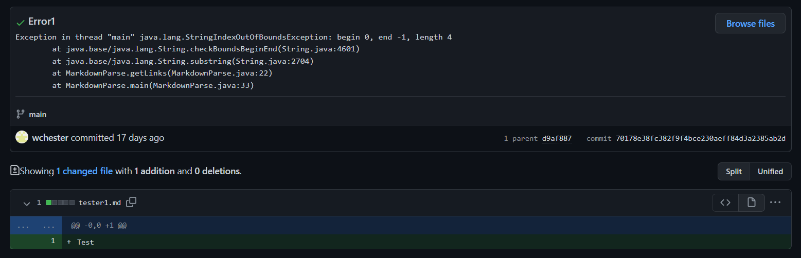
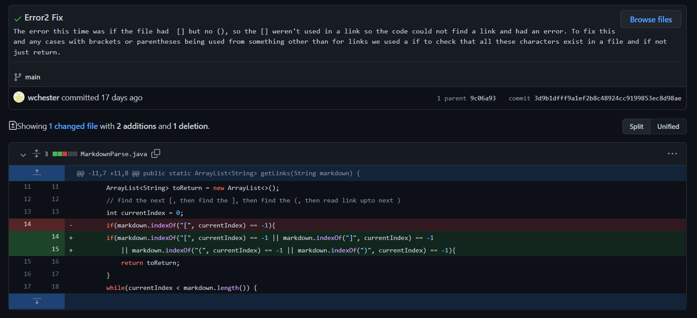
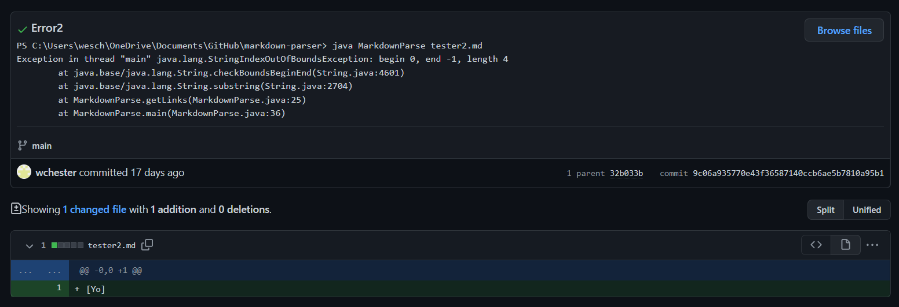

# Lab Report 2 - Week 4
## Error 1
Code change:

Test that caused failure:
[tester1](tester1.md)
 
Symptom:

The symptom here is a index out of bounds caused by the code not checking for the existence of starting syntax (a open bracket) of a link (the bug). For the tester1 which just has the text "Test" in it, when the code was run it tried to find the index of a open bracket but never found one, so -1 was returned. This is out of bounds for an array so that is why a index out of bounds error was thrown.

## Error 2

Test that caused failure:
[tester1](tester2.md)
 
Symptom:

The symptom here is a index out of bounds error that is caused by the code checking for the existence of only a open bracket and none of the other syntax for a link (the bug). Therefore, with the test file tester2 containing [yo] the code fails because it finds the index for the open and closed bracket but when it reaches the start parenthesis it returns -1 since that doesn't exist in this tester file. -1 is out of bounds for an array, thus causing the symptom. 
